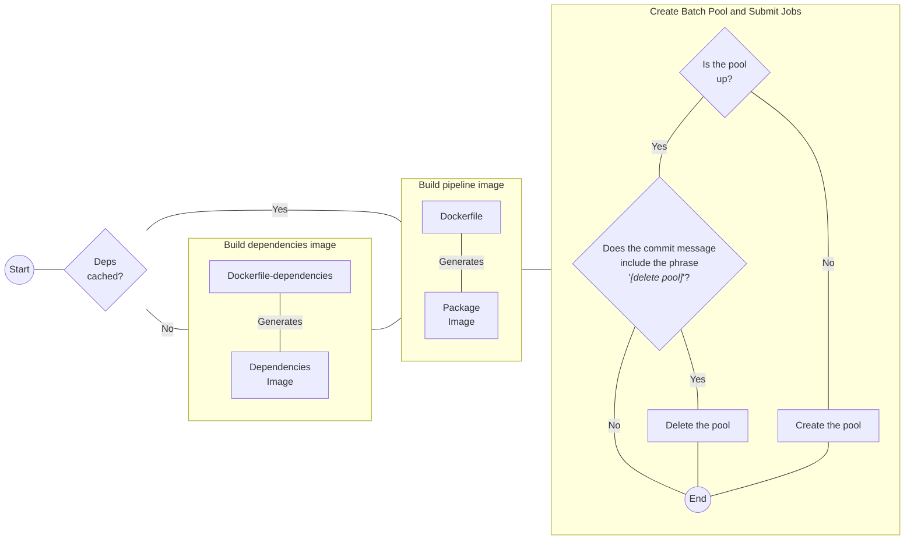

# CFA `{EpiNow2}` Pipeline

## Overview

This lightweight wrapper around [{EpiNow2}](https://github.com/epiforecasts/EpiNow2) adds functionality for deployment in Azure Batch.
It includes helper functions to:

* Interface with Azure services
* Convert input data to the expected `{EpiNow2}` input format
* Save outputs in standardized formats
* Add logging and metadata

The package supports deployment in CFA's computational environment.
While the code is open source, it may not easily support use outside CFA's infrastructure.

## Project Admin

- [@micahwiesner67](https://github.com/micahwiesner67)
- [@zsusswein](https://github.com/zsusswein)
- [@natemcintosh](https://github.com/natemcintosh)
- [@kgostic](https://github.com/kgostic)

## Structure

This repository contains the R package `{CFAEpiNow2Pipeline}` and follows standard R package conventions.
All PRs must pass `R CMD CHECK` as part of the CI pipeline before merging to main.
See `CONTRIBUTING.md` for details on contributing to the repository.

The package provides adapters and wrappers to run multiple `{EpiNow2}` models in parallel using cloud resources.
It reads from a standardized input format and writes to a standardized output format.
It enhances `{EpiNow2}` to support cloud deployments, further logging, and standardization of the R environment.

Note: This package standardizes how `{EpiNow2}` integrates into CFA's pipeline but does _not_ manage postprocessing, data extraction and transformation, or output visualization.

## Components

This package implements functions for:

1. [**Configuration**](https://cdcgov.github.io/cfa-epinow2-pipeline/reference/index.html#configuration): Loads parameters (e.g. prior distributions, generation intervals, right truncation) from a config passed at runtime.
    - Configs are validated at runtime, but generated in [a separate microservice](https://github.com/CDCgov/cfa-config-generator).
1. [**Data load**](https://cdcgov.github.io/cfa-epinow2-pipeline/reference/index.html#azure): Reads input data from the CFA data lake or from a local environment and formats it for input to `{EpiNow2}`.
    - Paths to data files are specified via the config.
1. [**Parameters**](https://cdcgov.github.io/cfa-epinow2-pipeline/reference/index.html#parameter): Loads validated generation interval, delay interval, and right truncation distributions from from the CFA data lake or from a local environment and formats them for use in `{EpiNow2}`.
1. [**Model run**](https://cdcgov.github.io/cfa-epinow2-pipeline/reference/index.html#pipeline): Manages R environment to run `{EpiNow2}` from a fixed random seed for both `{EpiNow2}` initialization and Stan sampling.
1. [**Outputs**](https://cdcgov.github.io/cfa-epinow2-pipeline/reference/index.html#write-output): Processes `{EpiNow2}` model fits to standardized posterior sample and quantile parquet files.
    - In the pipeline, the full model fits are also saved as `.rds` files (alongside these processed outputs).
1. **Metadata**: Extracts and saves metadata on the model run alongside model outputs.

The [`{cli}`](https://github.com/r-lib/cli) package is used for detailed R-style logging throughout.

## Output format

This package standardizes `{EpiNow2}` outputs into samples and summary tables, saving them along with metadata and logs in a consistent directory structure.
Outputs feed into a downstream post-processing pipeline (for e.g. plotting, scoring, and further analysis).

### Structure

Outputs are organized by job and task IDs to support automated and manual review workflows.
The job ID refers to a collection of models run together.
The task ID corresponds to a specific model instance.

Primarily machine-readable files (e.g., draws, summaries, diagnostics) are stored together for globbing.
Human-readable files (e.g. logs, model fit objects) are stored together by task.

```bash
<output>/
├── job_<job_id>/
│   ├── raw_samples/
│   │   ├── samples_<task_id>.parquet
│   ├── summarized_quantiles/
│   │   ├── summarized_<task_id>.parquet
│   ├── diagnostics/
│   │   ├── diagnostics_<task_id>.parquet
│   ├── tasks/
│   │   ├── task_<task_id>/
│   │   │   ├── model.rds
│   │   │   ├── metadata.json
│   │   │   ├── stdout.log
│   │   │   └── stderr.log
│   ├── job_metadata.json
```

- `<output>/`: Base output directory e.g. `/` in a Docker container or another specified path.
- `<job_id>/`: A directory named after the job ID, containing all related outputs. All tasks for a job are grouped here.
  - `raw_samples/`: Contains raw sample files for all tasks in the job.
    - `samples_<task_id>.parquet`: Raw model samples for a specific task ID. See [`process_samples()`](https://cdcgov.github.io/cfa-epinow2-pipeline/reference/sample_processing_functions.html).
  - `summarized_quantiles/`: Contains summarized quantile data for all tasks in the job.
    - `summarized_<task_id>.parquet`: Summarized quantiles for a specific task ID.  See [`process_quantiles()`](https://cdcgov.github.io/cfa-epinow2-pipeline/reference/sample_processing_functions.html).
  - `diagnostics/`: Contains model fit diagnostics for all tasks in the job.
    - `diagnostic_<task_id>.parquet`: Diagnostics relevant for a specific task ID. Columns are: `diagnostic`, `value`, `job_id`, `task_id`, `geo_value`, `disease`, and `model`.
  - `tasks/`: Contains one folder per task. These are primarily for manual review rather than automated processing.
    - `task_<task_id>/`: A task-specific folder with:
      - `model.rds`: The fitted `{EpiNow2}` model object.
      - `metadata.json`: Metadata about the task run.
      - `logs.txt`: Log file of all stdout and stderr.

### Model-estimated quantities

We use the `{EpiNow2}` model to correct for reporting delays in the observed time series data.
For more details about the model, see the vignette for [`EpiNow2::estimate_infections()`](https://epiforecasts.io/EpiNow2/articles/estimate_infections.html).
In particular, the section on [dealing with truncation](https://epiforecasts.io/EpiNow2/articles/estimate_infections.html#truncation) may be helpful.

We return the following `{EpiNow2}` Stan model quantities (as samples and summaries):

1. `reports[t]`: Expected nowcasted case count. Processed as `expected_nowcast_cases`.
1. `imputed_reports[t]`: Posterior-predicted nowcasted case count. [Generated](https://github.com/epiforecasts/EpiNow2/blob/4ec087b37cd85b572cb4daa8b4f177bf85f0a84a/inst/stan/estimate_infections.stan#L281-L290) by applying Poisson or negative binomial noise to the expected nowcasted case count. Processed as `pp_nowcast_cases`.
1. `obs_reports[t]`: Expected right-truncated case count. [Generated](https://github.com/epiforecasts/EpiNow2/blob/4ec087b37cd85b572cb4daa8b4f177bf85f0a84a/inst/stan/estimate_infections.stan#L169-L185) by truncating the expected nowcasted case count. Processed as `expected_obs_cases`.
1. `R[t]`: The time-varying effective reproduction number. Processed as `Rt`.
1. `r[t]` The instantaneous growth rate at time $t$. Processed as `growth_rate`.

## Running the pipeline

### Locally

The [`Makefile`](Makefile) may be used to build containers and run the pipeline locally using:

1. `make up` starts an interactive bash shell in the container with project directory mounted.
2. `make build` builds the Docker image with a given tag.
3. `make pull` logs in to Azure Container Registry and pulls the latest container image.
3. `make run` runs the pipeline from R interactively in the container.

These targets depend on the environment variables:

1. `CNTR_MGR`: The container manager. Defaults to `docker`. The option `podman` is also allowed if present locally on the system. Note that there can be some incompatibilities between `podman` and Azure services.
2. `TAG`: The tag used for the image. Defaults to the name of the branch.

The default repository is cfaprdbatchcr.azurecr.io.

For example, to build a dependency image using `podman` and the `latest` tag:

```bash
make build CNTR_MGR=podman TAG=latest
```

This is equivalent to running:

```bash
podman build -t cfaprdbatchcr.azurecr.io/cfa-epinow2-pipeline:zs-pipeline \
    --build-arg TAG=latest -f Dockerfile
```

Then, to run interactively:

```bash
make up TAG=latest
```

This is equivalent to running:

```bash
docker run \
    -v/wherever/your/pwd/is:/cfa-epinow2-pipeline -it --rm \
    cfaprdbatchcr.azurecr.io/cfa-epinow2-pipeline:latest
```

**Note**: The default value of `CNTR_MGR` is `docker`!

### Automation

The project uses GitHub Actions workflows to automate CI/CD.
Notably, the [`containers-and-az-pool.yaml`](.github/workflows/containers-and-az-pool.yaml) workflow executes jobs using a self-hosted runner, and serves as an entry point for starting the pipeline.
The workflow has the following three jobs:

1. **Build dependencies image** (`build-dependencies-image`): Creates a container image with all the dependencies required to build the R package. This job is cached to speed up the process, so it only updates the image if the [`Dockerfile-dependencies`](Dockerfile-dependencies) or the [`DESCRIPTION`](DESCRIPTION) file changes. The image is pushed to the Azure container registry: `cfaprdbatchcr.azurecr.io/cfa-epinow2-pipeline-dependencies:[branch name]`. The container image is based on the `rocker/r-ver:4.2.2` image; which sets the default CRAN repository to a [2024-10-30 snapshot](https://github.com/rocker-org/rocker-versioned2/wiki/Versions) of it.
1. **Build pipeline image** (`build-pipeline-image`): Using the previous image as a base, this job installs the R package and pushes the image to the Azure container registry: `cfaprdbatchcr.azurecr.io/cfa-epinow2-pipeline:[branch name]`.
1. **Create Batch Pool and Submit Jobs** (`batch-pool`): This final job creates a new Azure batch pool with ID `cfa-epinow2-pool-[branch name]` if it doesn't already exist. Additionally, if the commit message contains the string "`[delete pool]`", the pool is deleted.

Both container tags and pool IDs are based on the branch name, making it compatible with having multiple pipelines running simultaneously. The pool creation depends on Azure's Python SDK (see the file [.github/scripts/create_pool.py](.github/scripts/create_pool.py)), with the necessary credentials listed in a string at the top of the script.

> [!IMPORTANT]
> The CI will fail with branch names that are not valid tag names for containers. For more information, see the official Azure documentation [here](https://learn.microsoft.com/en-us/azure/azure-resource-manager/management/resource-name-rules#microsoftcontainerregistry).



## General Disclaimer
This repository was created for use by CDC programs to collaborate on public health related projects in support of the [CDC mission](https://www.cdc.gov/about/organization/mission.htm).  GitHub is not hosted by the CDC, but is a third party website used by CDC and its partners to share information and collaborate on software. CDC use of GitHub does not imply an endorsement of any one particular service, product, or enterprise.

## Public Domain Standard Notice
This repository constitutes a work of the United States Government and is not
subject to domestic copyright protection under 17 USC § 105. This repository is in
the public domain within the United States, and copyright and related rights in
the work worldwide are waived through the [CC0 1.0 Universal public domain dedication](https://creativecommons.org/publicdomain/zero/1.0/).
All contributions to this repository will be released under the CC0 dedication. By
submitting a pull request you are agreeing to comply with this waiver of
copyright interest.

## License Standard Notice
The repository utilizes code licensed under the terms of the Apache Software
License and therefore is licensed under ASL v2 or later.

This source code in this repository is free: you can redistribute it and/or modify it under
the terms of the Apache Software License version 2, or (at your option) any
later version.

This source code in this repository is distributed in the hope that it will be useful, but WITHOUT ANY
WARRANTY; without even the implied warranty of MERCHANTABILITY or FITNESS FOR A
PARTICULAR PURPOSE. See the Apache Software License for more details.

You should have received a copy of the Apache Software License along with this
program. If not, see http://www.apache.org/licenses/LICENSE-2.0.html

The source code forked from other open source projects will inherit its license.

## Privacy Standard Notice
This repository contains only non-sensitive, publicly available data and
information. All material and community participation is covered by the
[Disclaimer](https://github.com/CDCgov/template/blob/master/DISCLAIMER.md)
and [Code of Conduct](https://github.com/CDCgov/template/blob/master/code-of-conduct.md).
For more information about CDC's privacy policy, please visit [http://www.cdc.gov/other/privacy.html](https://www.cdc.gov/other/privacy.html).

## Contributing Standard Notice
Anyone is encouraged to contribute to the repository by [forking](https://help.github.com/articles/fork-a-repo)
and submitting a pull request. (If you are new to GitHub, you might start with a
[basic tutorial](https://help.github.com/articles/set-up-git).) By contributing
to this project, you grant a world-wide, royalty-free, perpetual, irrevocable,
non-exclusive, transferable license to all users under the terms of the
[Apache Software License v2](http://www.apache.org/licenses/LICENSE-2.0.html) or
later.

All comments, messages, pull requests, and other submissions received through
CDC including this GitHub page may be subject to applicable federal law, including but not limited to the Federal Records Act, and may be archived. Learn more at [http://www.cdc.gov/other/privacy.html](http://www.cdc.gov/other/privacy.html).

## Records Management Standard Notice
This repository is not a source of government records but is a copy to increase
collaboration and collaborative potential. All government records will be
published through the [CDC web site](http://www.cdc.gov).

## Additional Standard Notices
Please refer to [CDC's Template Repository](https://github.com/CDCgov/template) for more information about [contributing to this repository](https://github.com/CDCgov/template/blob/main/CONTRIBUTING.md), [public domain notices and disclaimers](https://github.com/CDCgov/template/blob/main/DISCLAIMER.md), and [code of conduct](https://github.com/CDCgov/template/blob/main/code-of-conduct.md).
