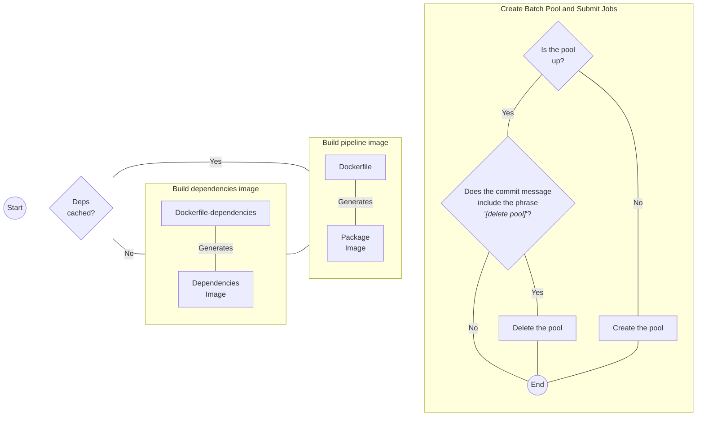

# CFA `{EpiNow2}` Pipeline

## Overview

A lightweight wrapper around [{EpiNow2}](https://github.com/epiforecasts/EpiNow2) to add functionality for deployment in Azure Batch.
It holds some helper functions to interface with Azure services, convert input data to EpiNow2's expected input format, and save expected outputs.
It also adds metadata and logging.

This package is meant to enhance the `{EpiNow2}` package to support deployment in CFA's computational environment.
The code is open source as part of CFA's goals around development, but it may not be possible to support extensions to additional environments.

## Structure

This repository holds an R package, `{CFAEpiNow2Pipeline}`.
The repository is structured as a standard R package.
All PRs pass R CMD check as part of the CI suite as a pre-condition for merge to main.
If interested in contributing see `CONTRIBUTING.md` and open an issue or a PR.

The package contains contains some adapters and wrappers to run to run many independent `{EpiNow2}` models in parallel with cloud resources.
The adapters read from datasets with standardized formats and produces outputs as flat files with standard names.
The wrapper functions enhance `{EpiNow2}` functionality to support cloud deployments, adding more logging and standardizing the R environment.

This package standardizes the interface to `{EpiNow2}` for purposes of deployment in a pipeline as part of a suite of models.
This package does _not_ manage pipeline deployment or kickoff, data extraction and transformation, or model output visualization.

## Components

This package implements functions for:

1. **Configuration**: Loads parameters such as prior distributions, generation intervals, and right-truncation from a config in a standard schema, with the path to this config passed at runtime.
    - The config is validated at runtime, but config generation is specified at pipeline runtime and not part of this package.
1. **Data load**: Loads data from the CFA data lake or from a local environment and translates it from CFA's schema to the expected `{EpiNow2}` format.
    - Paths are specified via the config
1. **Parameters**: Loads pre-specified and -validated generation interval, delay interval, and right-truncation distributions from from the CFA data lake or from a local environment and formats them for use in EpiNow2.
1. **Model run**: Manages R environment to run `{EpiNow2}` from a fixed random seed, both for `{EpiNow2}` initialization and Stan sampling.
1. **Outputs**: Provides functionality to process `{EpiNow2}` model fits to a standardised flat output format (as described in forthcoming link). Within the pipeline, model fits are saved both in their entirety as `.rds` files, as well as via this flat output format.
1. **Logging**: Steps in the pipeline have comprehensive R-style logging, with the the [cli](https://github.com/r-lib/cli) package
1. **Metadata**: Extract comprehensive metadata on the model run and store alongside outputs

## Output format

The end goals of this package is to standardize the raw outputs from EpiNow2 into samples and summaries tables, and to write those standardized outputs, along with relevant metadata, logs, etc. to a standard directory structure. Once in CFA's standard format, the outputs can be passed into a separate pipeline that handles post-processing (e.g. plotting, scoring, analysis) of Rt estimates from several different Rt estimation models.

### Directories

The nested partitioning structure of the outputs is designed to facilitate both automated processes and manual investigation: files are organized by job and task IDs, allowing for efficient file operations using glob patterns, while also maintaining a clear hierarchy that aids human users in navigating to specific results or logs. Files meant primarily for machine-readable consumption (i.e., draws, summaries, diagnostics) are structured together to make globbing easier. Files meant primarily for human investigation (i.e., logs, model fit object) are grouped together by task to facilitate manual workflows.
In this workflow, task IDs correspond to location specific model runs (which are independent of one another) and the jobid refers to a unique model run and disease. For example, a production job should contain task IDs for each of the 50 states and the US, but a job submitted for testing or experimentation might contain a smaller number of tasks/locations.

```bash
<output>/
├── job_<job_id>/
│   ├── raw_samples/
│   │   ├── samples_<task_id>.parquet
│   ├── summarized_quantiles/
│   │   ├── summarized_<task_id>.parquet
│   ├── diagnostics/
│   │   ├── diagnostics_<task_id>.parquet
│   ├── tasks/
│   │   ├── task_<task_id>/
│   │   │   ├── model.rds
│   │   │   ├── metadata.json
│   │   │   ├── stdout.log
│   │   │   └── stderr.log
│   ├── job_metadata.json
```

- `<output>/`: The base output directory. This could, for example, be `/` in a Docker container or dedicated output directory.
- `job_<job_id>/`: A directory named after the specific job identifier, containing all outputs related to that job. All tasks within a job share this same top-level directory.
  - `raw_samples/`: A subdirectory within each job folder that holds the raw sample files from all tasks in the job. Task-specific *draws* output files all live together in this directory to enable easy globbing over task-partitioned outputs.
    - `samples_<task_id>.parquet`: A file containing raw samples from the model, associated with a particular task identifier. This file has columns `job_id`, `task_id`, `geo_value`, `disease`, `model`, `_draw`, `_chain`, `_iteration`, `_variable`, `value`, and `reference_date`. These variables follow the [{tidybayes}](https://mjskay.github.io/tidybayes/articles/tidybayes.html) specification.
  - `summarized_quantiles/`: A subdirectory for storing summarized quantile data. Task-specific *summarized* output files all live together in this directory to enable easy globbing over task-partitioned outputs.
    - `summarized_<task_id>.parquet`: A file with summarized quantiles relevant to a specific task identifier.  This file has columns `job_id`, `task_id`, `geo_value`, `disease`, `model`, `value`, `_lower`, `_upper`, `_width`, `_point`, `_interval`, and `reference_date`. These variables follow the [{tidybayes}](https://mjskay.github.io/tidybayes/articles/tidybayes.html) specification.
  - `diagnostics/`: A subdirectory for storing model fit diagnostics. Task-specific *diagnostic* output files all live together in this directory to enable easy globbing over task-partitioned outputs.
    - `diagnostic_<task_id>.parquet`: A file with diagnostics relevant to a specific task identifier.  This file has columns `diagnostic`, `value`, `job_id`, `task_id`, `geo_value`, `disease`, and `model`.
  - `tasks/`: This directory contains subdirectories for each task within a job. These are files that are less likely to require globbing from the data lake than manual investigation, so are stored togehter.
    - `task_<task_id>/`: Each task has its own folder identified by the task ID, which includes several files:
      - `model.rds`: An RDS file storing the EpiNow2 model object fit to the data.
      - `metadata.json`: A JSON file containing additional metadata about the model run for this task.
      - `stdout.log`: A log file capturing standard output from the model run process.
      - `stderr.log`: A log file capturing standard error output from the model run process.
- `job_metadata.json`: A JSON file located in the root of each job's directory, providing metadata about the entire job.

### Model-estimated quantities

EpiNow2 estimates the incident cases $\hat y_{td}$ for timepoint $t \in \{1, ..., T\}$ and delay $d \in \{1, ..., D\}$ where $D \le T$. In the single vintage we're providing to EpiNow2, the delay $d$ moves inversely to timepoints, so $d = T - t + 1$.

The observed data vector of length $T$ is $y_{td} \in W$. We supply a nowcasting correction PMF $\nu$ for the last $D$ timepoints where $\nu_d \in [0, 1],$ and $\sum_{d=1}^D\nu_d = 1$. We also have some priors $\Theta$.

We use EpiNow2's generative model $f(y, \nu, \Theta)$.

EpiNow2 is a forward model that produces an expected nowcasted case count for each $t$ and $d$ pair: $\hat \gamma_{td}$.
 It applies the nowcasting correction $\nu$ to the last $D$ timepoints of $\hat \gamma$ to produce the expected right-truncated case count $\hat y$. Note that these _expected_ case counts (with and without right-truncation) don't have observation noise included.

We can apply negative binomial observation noise using EpiNow2's estimate of the negative binomial overdispersion parameter $\hat \phi$ and the expected case counts. The posterior predictive distributions of nowcasted case counts is $\tilde \gamma \sim \text{NB}(\hat \gamma, \hat \phi)$. The posterior predicted right-truncated case count is $\tilde y \sim \text{NB}(\hat y, \hat \phi)$.

We can get 3 of these 4 quantities pre-generated from the returned EpiNow2 Stan model:

- $\hat \gamma$: The expected nowcasted case count is `reports[t]`
- $\hat y$: The expected right-truncated case count is `obs_reports[t]`
- $\tilde \gamma$: The posterior-predicted nowcasted case count is `imputed_reports[t]`
- $\tilde y$: The posterior-predicted right-truncated case count isn't returned by EpiNow2.

We also save the $R_t$ estimate at time $t$ and the intrinsic growth rate at time $t$.

## Automation

The project has multiple GitHub Actions workflows to automate the CI/CD process. Notably, the [`containers-and-az-pool.yaml`](.github/workflows/containers-and-az-pool.yaml) workflow executes jobs using a self-hosted runner, and serves as an entry point for starting the pipeline. The workflow has the following three jobs:

- **Build dependencies image** (`build-dependencies-image`): Creates a container image with all the dependencies required to build the R package. This job is cached to speed up the process, so it only updates the image if the [`Dockerfile-dependencies`](Dockerfile-dependencies) or the [`DESCRIPTION`](DESCRIPTION) file changes. The image is pushed to the Azure container registry: `cfaprdbatchcr.azurecr.io/cfa-epinow2-pipeline-dependencies:[branch name]`.

- **Build pipeline image** (`build-pipeline-image`): Using the previous image as a base, this job installs the R package and pushes the image to the Azure container registry: `cfaprdbatchcr.azurecr.io/cfa-epinow2-pipeline:[branch name]`.

- **Create Batch Pool and Submit Jobs** (`batch-pool`): This final job creates a new Azure batch pool with id `cfa-epinow2-pool-[branch name]` if it doesn't already exist. Additionally, if the commit message contains the string "`[delete pool]`", the pool is deleted.

Both container tags and pool ids are based on the branch name, making it compatible with having multiple pipelines running simultaneously. The pool creation depends on Azure's Python SDK (see the file [azure/pool.py](azure/pool.py)), with the necessary configuration in a toml file stored as a secret in the repository (`POOL_CONFIG_TOML`). A template of the configuration file can be found at [azure/pool-config-template.toml](azure/pool-config-template.toml). The current configuration file is stored in the project's Azure datalake under the name `cfa-epinow2-pipeline-config.toml.toml`.

> [!IMPORTANT]
> The CI will fail with branch names that are not valid tag names for containers. For more information, see the official Azure documentation [here](https://learn.microsoft.com/en-us/azure/azure-resource-manager/management/resource-name-rules#microsoftcontainerregistry).



## Container images

The project includes container images for running the pipelines. Particularly, the GitHub Action workflow located in [.github/workflows/containers-and-az-pool.yaml](.github/workflows/containers-and-az-pool.yaml) automatically builds an image based on [Dockerfile](Dockerfile) and pushes it to Azure Container Registry. The images can also be built locally, in which case the [Makefile](Makefile) included in the project contains the following targets:

- `make deps` will build the image with the required dependencies for the package.
- `make build` will build the image containing the R package.
- `make interactive` will lunch the image in interactive mode.

All three targets depend on the environment variables `CNTR_MGR` (defults to `docker`) and `TAG` (defaults to `local`). For instance, if you wanted to build the dependency image using `podman` and the `latest` tag, you can do the following:

```bash
make build CNTR_MGR=podman TAG=zs-pipeline
```

```bash
podman build -t cfaprdbatchcr.azurecr.io/cfa-epinow2-pipeline:zs-pipeline \
    --build-arg TAG=zs-pipeline -f Dockerfile
```

To run interactively, you can use the following target:

```bash
make interactive TAG=zs-pipeline
```

which is equivalent to run:

**NOTICE docker IS THE DEFAULT CNTR_MGR**

```bash
docker run \
    -v/wherever/your/pwd/is:/cfa-epinow2-pipeline -it --rm \
    cfaprdbatchcr.azurecr.io/cfa-epinow2-pipeline:zs-pipeline
```


## Project Admin

- @zsusswein
- @natemcintosh
- @kgostic

## General Disclaimer
This repository was created for use by CDC programs to collaborate on public health related projects in support of the [CDC mission](https://www.cdc.gov/about/organization/mission.htm).  GitHub is not hosted by the CDC, but is a third party website used by CDC and its partners to share information and collaborate on software. CDC use of GitHub does not imply an endorsement of any one particular service, product, or enterprise.

## Public Domain Standard Notice
This repository constitutes a work of the United States Government and is not
subject to domestic copyright protection under 17 USC § 105. This repository is in
the public domain within the United States, and copyright and related rights in
the work worldwide are waived through the [CC0 1.0 Universal public domain dedication](https://creativecommons.org/publicdomain/zero/1.0/).
All contributions to this repository will be released under the CC0 dedication. By
submitting a pull request you are agreeing to comply with this waiver of
copyright interest.

## License Standard Notice
The repository utilizes code licensed under the terms of the Apache Software
License and therefore is licensed under ASL v2 or later.

This source code in this repository is free: you can redistribute it and/or modify it under
the terms of the Apache Software License version 2, or (at your option) any
later version.

This source code in this repository is distributed in the hope that it will be useful, but WITHOUT ANY
WARRANTY; without even the implied warranty of MERCHANTABILITY or FITNESS FOR A
PARTICULAR PURPOSE. See the Apache Software License for more details.

You should have received a copy of the Apache Software License along with this
program. If not, see http://www.apache.org/licenses/LICENSE-2.0.html

The source code forked from other open source projects will inherit its license.

## Privacy Standard Notice
This repository contains only non-sensitive, publicly available data and
information. All material and community participation is covered by the
[Disclaimer](https://github.com/CDCgov/template/blob/master/DISCLAIMER.md)
and [Code of Conduct](https://github.com/CDCgov/template/blob/master/code-of-conduct.md).
For more information about CDC's privacy policy, please visit [http://www.cdc.gov/other/privacy.html](https://www.cdc.gov/other/privacy.html).

## Contributing Standard Notice
Anyone is encouraged to contribute to the repository by [forking](https://help.github.com/articles/fork-a-repo)
and submitting a pull request. (If you are new to GitHub, you might start with a
[basic tutorial](https://help.github.com/articles/set-up-git).) By contributing
to this project, you grant a world-wide, royalty-free, perpetual, irrevocable,
non-exclusive, transferable license to all users under the terms of the
[Apache Software License v2](http://www.apache.org/licenses/LICENSE-2.0.html) or
later.

All comments, messages, pull requests, and other submissions received through
CDC including this GitHub page may be subject to applicable federal law, including but not limited to the Federal Records Act, and may be archived. Learn more at [http://www.cdc.gov/other/privacy.html](http://www.cdc.gov/other/privacy.html).

## Records Management Standard Notice
This repository is not a source of government records but is a copy to increase
collaboration and collaborative potential. All government records will be
published through the [CDC web site](http://www.cdc.gov).

## Additional Standard Notices
Please refer to [CDC's Template Repository](https://github.com/CDCgov/template) for more information about [contributing to this repository](https://github.com/CDCgov/template/blob/main/CONTRIBUTING.md), [public domain notices and disclaimers](https://github.com/CDCgov/template/blob/main/DISCLAIMER.md), and [code of conduct](https://github.com/CDCgov/template/blob/main/code-of-conduct.md).
