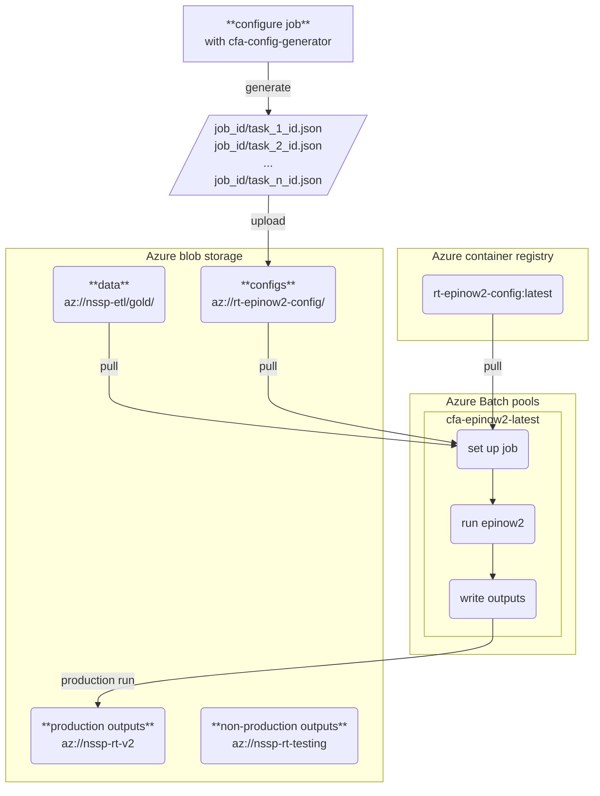
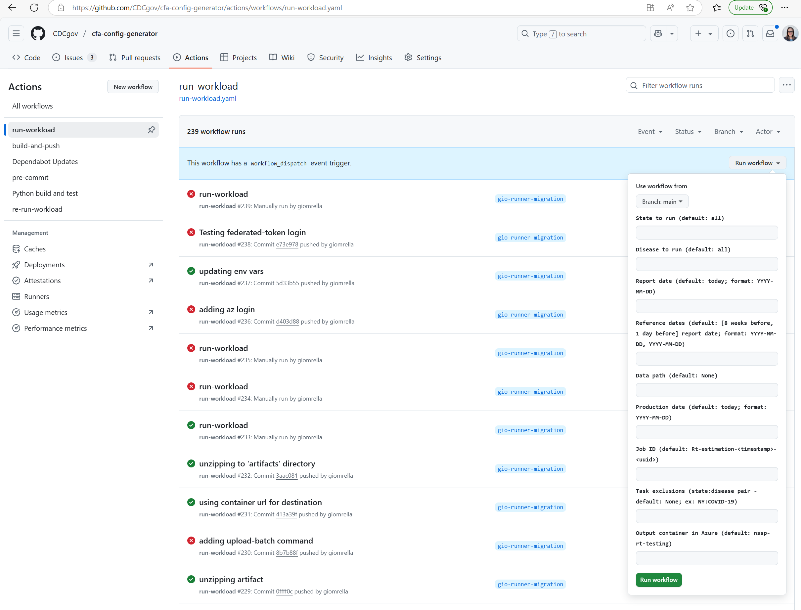

## Epinow2 Rt Pipeline
This document is meant to guide someone in running the weekly Rt estimation pipeline from within the VAP (Virtual Analytic Platform). The main command for running the weekly pipeline (found in the Makefile) is `make run-prod`. Running this will create and utilize a suite of configuration files (.json) specified from within the associated blob storage account and will produce outputs in the `rt-epinow2-output` Azure blob storage account.

## Introduction

### The whole workflow
(For a production run on main)




### Definitions

A **job** is a unique pipeline run, which consists of a set of configuration files that fully define the run, and a set of outputs. The `job_id` a unique tag assigned by the config generator that links the configuration files to the run and the outputs. A job may contain many tasks (e.g. a typical production job contains tasks for each of 51 jurisdictions * 2 diseases = 102 tasks, each with their own `task_id`). Each task is reproducible and defined by its own .json config file.

### A full pipeline run consists of

1. Use the [cfa-config-generator](https://github.com/CDCgov/cfa-config-generator) to create a new job_id, generate configuration files for your job and upload them to blob.
2. Set up the job

    - In Azure, this involves pulling the appropriate container image, configuration files, and data into the appropriate Azure Batch pool. Usually, we use the "cfa-epinow2-pipeline:latest" image and pool, which correspond to the main branch of the cfa-epinow2-pipeline repo. We have set up continuous deployment workflows in this repo so that the image should be pre-loaded in the container registry, and the pool should be idling and ready to run a job without any action from you.
    - You may also pull these resources down to run a job locally, e.g. using the computing power of your VAP image. But we don't recommend this unless you are running a small job with few tasks, because your local machine does not provide the same parallelism as Batch.
    - If you are developing code on a branch in this repo, opening a PR or draft PR will trigger GH actions that will build a pool and container tagged with your branch name, "cfa-epinow2-pipeline:my_branch", and the makefile in this repo will automatically configure the job to run using the pool and image corresponding to your branch so that you can test your updates in Azure. Note, however, that the pool and container image will contain the latest version of the code pushed to the remote, not the latest version you have locally, and you will need to wait for the pool and image to rebuild in the cloud after each push to GitHub.
3. Run the job. Once all the required inputs are on a computer, inside the appropriate container image, for each task, the epinow2 model will run, generate $R_t$ estimates, and write them to the container's file system.
4. Upload the outputs from the container to a persistent storage location, such as Azure Blob (or for local runs, to your local filesystem).

Downstream of this pipeline, the cfa-Rt-postprocessing repo provides additional tools to parse and evaluate the model's outputs.

This may seem complicated, but once you have your dependencies and credentials set up, the whole workflow can be run with a single call to `make run-prod` at the command line. This SOP will walk your through the required setup and the underlying steps.

### Storage and related repos

- https://github.com/CDCgov/cfa-config-generator: a microservice that generates
  configuration files, and uploads them to Azure blob storage
- https://github.com/CDCent/cfa-rt-postprocessing: a repo with tools for postprocessing of Rt estimates
- `az://rt-epinow2-config/` an Azure blob storage container that holds
   configuration files
- `az://nssp-rt-v2/` an Azure blob storage container where we store production outputs
- `az://nssp-rt-testing/` a blob storage container where we store non-production outputs
- `az://nssp-rt-post-process/` a blob storage container where we store output from the post processor.

# Getting started

### Pre-requisites
1. VAP environment & Account
	- git (`sudo apt-get install git`)
	- docker CLI ([follow this script](https://teams.microsoft.com/l/message/19:064fb29dee654148b647dc8b9bab0782@thread.tacv2/1728396548512?tenantId=9ce70869-60db-44fd-abe8-d2767077fc8f&groupId=4f34eba7-8fcb-4a26-9b34-a434ea777f0c&parentMessageId=1728396548512&teamName=CFA-Predict&channelName=Help&createdTime=1728396548512)). See the [appendix](#appendix) if you wish to use
	podman instead for local runs.
	- gh CLI (`sudo apt-get install gh`)

2. cfa-epinow2-pipeline repository in VAP
	- Navigate to where you would like to clone the repository code
	- Clone the repository (`git clone https://www.github.com/cdcgov/cfa-epinow2-pipeline` OR `gh auth login` and then `gh repo clone cdcgov/cfa-epinow2-pipeline`)

3. Authentication to Azure
To authenticate to the requisite Azure resources provide a `.env` file containing the secrets necessary for authentication.
	- Request access to necessary Azure credential file (.env) from any of the admins listed in the README.md
	- decrypt the file (`gpg --decrypt .env`)
	- Place the decrypted file in your `cfa-epinow2-pipeline` directory

### Test Pre-requisites are Setup
#### Test Configuration Generation
1. `make config`
Running this command runs code located in the CDCgov/cfa-config-generator repository. This command creates a suite of configuration files, following the default settings for
a production run, and saves it into `az:/rt-epinow2-config/{job_id}`.
If successful, the job id will print to the command line:

```
make config
> gh workflow run \
>   -R cdcgov/cfa-config-generator run-workload.yaml \
>   -f disease=all \
>   -f state=all \
>   -f job_id=Rt-estimation-20250318_1717845
> Created workflow_dispatch event for `run_workload.yaml` at main
```

Verify that you can locate the configuration files in Azure blob storage.

If you receive an error that you do not have the necessary permissions to run this command please reach out Agastya Mondal (ab59@cdc.gov) for assistance.

#### Test make run command
1. The following command will test your setup for using the `CFAEpiNow2Pipeline` package. This command will run the pipeline for a single state and disease locally (using the computing power of your VAP account). This will take a few minutes. (N.B. the test config runs a short chain, and will be faster than a run using the default chain length.) `make run CONFIG=test/test.json`

	**Knowledge check:** Where can you find the `test/test.json` config file?

	<details>
  	<summary>Hint</summary>
  	Look somewhere in Azure blob storage.
	</details>

	<details>
  	<summary>Answer</summary>
  	`az:/rt-epinow2-config/test/`. This is the same pattern as in the
		config generation step, except that "test" is the job_id in this case.
	</details><br>

	**Knowledge check:** Where can you find the outputs of a local run?

	<details>
  	<summary>Answer</summary>
  	`ls` should reveal two new local directories: `inputs/` contains a copy of
		the model inputs, and `job_id` contains the model outputs. These files are
		copied from the container to your local file system. Feel free to clean them
		up using `rm -r inputs` and `rm -r test`.
	</details>
<br>

2. The following command will test your connection to Azure Batch resources. This command will run the pipeline for a single state (NY) and run using Azure Batch resources. To track the status of the nodes and pool, open Azure Batch Explorer. The outputs will write
to the `nssp-rt-testing` container, in a directory labeled with the job_id printed
to your command line. `make test-batch`

	**Knowledge check:** Verify that you know how to track the jobs running in the
batch explorer. Locate the outputs in Azure blob storage. Explore the
contents, and open `tasks/{taks_id}/logs.txt` which is useful for debugging.

	<details>
  	<summary>Hint</summary>
  	The outputs will be written to `az:/nssp-rt-testing/{job_id}/`
	</details>

### Rt Estimation Pipeline (Production)
If you have successfully setup the pre-requisites and are able to run `make config` and `make run CONGIF=test/test.json` you are ready to run the entire pipeline in production `make run-prod`.
This command will run `make config`, then followed by a docker build, and then will the `job.py` script from in Batch; you only need to run `make run-prod` all of the work is done for you inside the Makefile! In doing so you are connecting to Azure Batch and setup 102 unique tasks that Azure Batch will run. This command is intended to close after initializing the jobs in Azure Batch. Please open Azure Batch Explorer to view the progress of these tasks.

#### Exclusions and modifications
After reviewing the initial run, we may choose to make two kinds of changes to
the models. First, we may exclude the results from the released predictions,
if the data or the model do not pass quality checks. Second, we may exclude one
or more data points from a specific state's data, e.g. if there is evidence of a
reporting anomaly on that date.

##### State (task) Exclusions
Excluding a state from the released production files occurs downstream of this modeling
pipeline, in the postprocessing step. Even if a state was run, and results were generated, the postprocessor can be configured to skip over the excluded jurisdictions when collecting the modeling results.

To exclude a state from the initial model run (e.g. if no data were received), generate appropriate configs. Task exclusions are state and disease pairs (ex. 'NY:COVID-19)' that users can specify when running the config generator so that tasks for specified state disease pairs are not generated unnecessarily. Users can specify more than one state and disease pair, so long as they are separate by a ',' (ex. 'NY:COVID-19,WA:Influenza'). To do so, a user will need to first, generate the configuration files and specify the state:disease pair to exclude (see example below) and then run the pipeline for these configurations.

1. `TIMESTAMP=$(date -u +"%Y%m%d_%H%M%S"); JOB_ID=Rt-estimation-$(echo $TIMESTAMP)`
2. `gh workflow run -R cdcgov/cfa-config-generator run-workload.yaml -f job_id=$(echo $JOB_ID) -f task_exclusions='NY:COVID-19', -f output_container='nssp-rt-v2'`
3. `make run-batch JOB=$(echo $JOB_ID)`

Note: the `JOB=$(echo $JOB_ID)` option in step 3. instructs the model
run to use the config files generated in steps 1. and 2. Without this option,
`make run-batch` will generate new configs using the default settings, and will
run using those.

##### Data Exclusions
The process for handling data exclusions is currently being finalized and this section will be finalized in April 2025. For the current procedure please reach out to Patrick Corbett (pyv3@cdc.gov).

## Non-production runs
The config file uniquely defines a run. To kick off a non-production run, test,
or experiment, generate an appropriate set of configs.

**DO NOT** Write tests or experimental output to the production container,
`nssp-rt-v2`. Instead, please direct non-production output to `nssp-rt-testing`.
The testing container is the default output container in the config generator.

There are three ways to generate configs:

1. Use the GUI in the config generation repo
Navigate to https://github.com/CDCgov/cfa-config-generator/actions/workflows/run-workload.yaml,
click the "Run workflow" dropdown menu, specify your parameters, and hit "Run workflow".
This will write a set of configs to `az:/rt-epinow2-config/{job_id}`. Then run
`make run-batch JOB=job_id` to run the models using the configs you just generated.


2. Use the comand line
`gh workflow run -R cdcgov/cfa-config-generator run-workload.yaml -f job_id='my_job_id' -f task_exclusions='NY:COVID-19', -f output_container='nssp-rt-testing'`
Use -f flags to specify arguments different from the defaults

3. (We recommend you do NOT) run `make config`.
This will specify the production container, `nssp-rt-v2`, as the output destination.
We don't want to contaminate the production output with test runs and experiments.
Use this for production runs only.

Note that if you need to modify a config, you may download it from blob, edit,
and re-upload to overwrite the copy in blob.

### Appendix
#### Podman
The default container management software is setup to utilize docker. For users that are currently using podman, please adjust the variable `CNTR_MGR` within the makefile prior to running any commands. Further, it will be necessary to authenticate to azure resources through podman (`podman login`).
